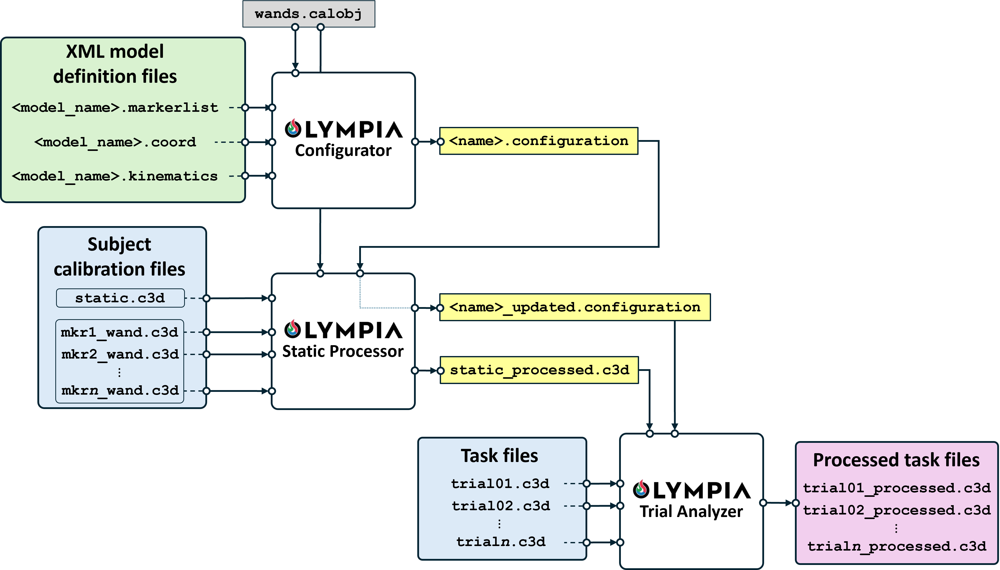

# Olympia-MATLAB

[](http://creativecommons.org/licenses/by/4.0/) [](https://doi.org/10.5281/zenodo.15537123)

The **OlympiaSW** is a MATLAB-based software package for computing the kinematics, kinetics and spatiotemporal parameters of sprinting according to the marker-based model proposed in Di Marco, et al. (submitted 2025).

## Usage

The architecture of the OlympiaSW and the data processing flow is shown in the flow-chart below (as taken from Di Marco, et al. - submitted 2025).



Detailed documentation, usage instructions, and tutorial videos are available in the [Wiki section of this repository](https://github.com/ProOlympia-INAIL-UNIPD/Olympia-MATLAB/wiki).

## Requirements

- MATLAB R2024b or later
- BTK toolbox, available at: https://biomechanical-toolkit.github.io/docs/Wrapping/Matlab/index.html
- Aerospace Toolbox
- Automated Driving Toolbox
- Control System Toolbox
- Lidar Toolbox
- Navigation Toolbox
- ROS Toolbox
- Robotics System Toolbox
- Signal Processing Toolbox
- Statistics and Machine Learning Toolbox
- Symbolic Math Toolbox
- UAV Toolbox

## Installation

To install **OlympiaSW**, follow these steps:

1. **Download the repository**

   You can clone the repository using Git:

   ```bash
   git clone https://github.com/ProOlympia-INAIL-UNIPD/Olympia-MATLAB.git

Or download it as a ZIP archive from GitHub and extract it.

2. **Save the folder**
Save the folder in a convenient location on your computer, for example:
/Users/yourname/Documents/MATLAB/OlympiaSW

3. **Add the folder to your MATLAB path**
Open MATLAB and add the package folder to your MATLAB path. You can do this with the following command:
addpath(genpath('/your/path/to/OlympiaSW'))
savepath

Replace /your/path/to/OlympiaSW with the actual path on your machine.

Alternatively, you can add the folder via Home > Set Path > Add with Subfolders..., then click Save.

## Contact

For questions on package usage, please contact:

- **Roberto Di Marco** — [roberto.dimarco@univr.it](mailto:roberto.dimarco@univr.it), [r.dimarco@inail.it](mailto:r.dimarco@inail.it)  
- **Giuseppe Zullo** — [giuseppe.zullo@unipd.it](mailto:giuseppe.zullo@unipd.it)  
- **Samira Giuliana Breban** — [samira.breban@unipd.it](mailto:samira.breban@unipd.it)

## How to cite

If you use this package, please cite it as:

> Di Marco, R., Zullo, G., & Breban, S. G. (2025). *OlympiaSW* (Version 1.1.0). GitHub. https://github.com/ProOlympia-INAIL-UNIPD/Olympia-MATLAB  
> DOI: 10.5281/zenodo.15537123
